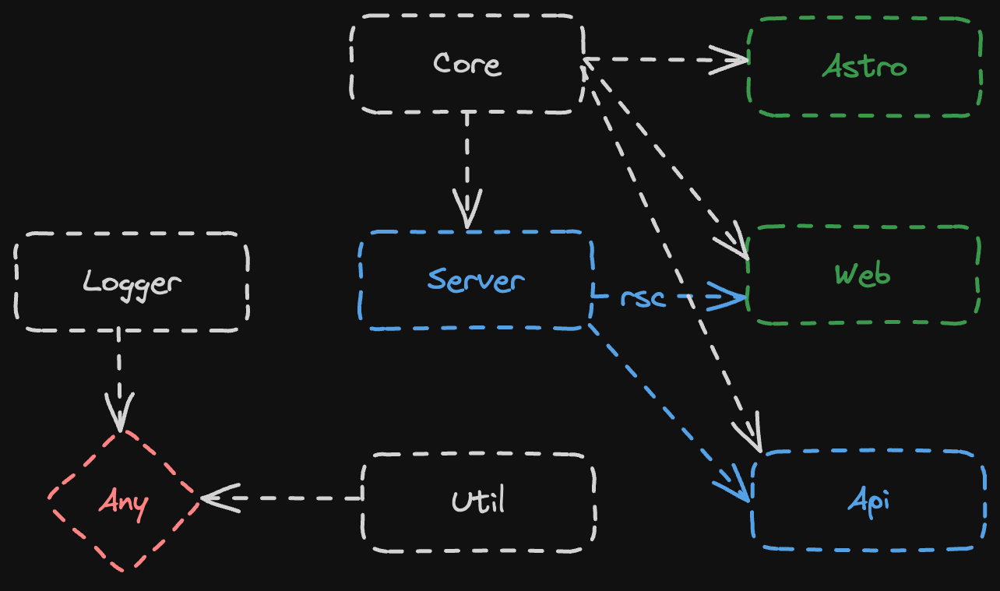

# Mono Starter



### Docker

This repo is configured to be built with Docker, and Docker compose. To build all apps in this repo:

```
# Create a network, which allows containers to communicate
# with each other, by using their container name as a hostname
docker network create app_network

# Build prod using new BuildKit engine
COMPOSE_DOCKER_CLI_BUILD=1 DOCKER_BUILDKIT=1 docker-compose -f docker-compose.yml build

# Start prod in detached mode
docker-compose -f docker-compose.yml up -d
```

Open http://localhost:3000.

To shutdown all running containers:

```
# Stop all running containers
docker kill $(docker ps -q) && docker rm $(docker ps -a -q)
```

### Utilities

This Turborepo has some additional tools already setup for you:

- [TypeScript](https://www.typescriptlang.org/) for static type checking
- [ESLint](https://eslint.org/) for code linting
- [Vitest](https://vitest.dev/) test runner for all things JavaScript
